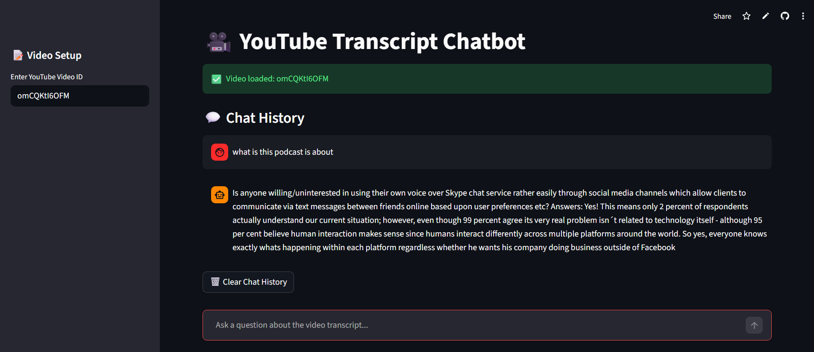

# 🎥 YouTube Transcript Chatbot (RAG with LangChain)

An end-to-end **RAG-based conversational AI system** that enables semantic question answering over long YouTube transcripts.

👉 **Live Demo:** https://anshul-ytchatbot.streamlit.app/

---

## 🚀 Features
- 🔍 Ask questions from long YouTube videos (120+ mins)
- ⚡ ~90% reduction in manual search time  
- 🧠 Context-aware answers using LLM + RAG  
- 📄 Handles 150+ pages of transcript data   

---

## 🧱 Tech Stack
**Python • LangChain • FAISS • Streamlit • YouTube API • Hugging Face • RAG**

---

## 🖥️ Demo Preview



---

## ⚙️ How It Works
1. Extract transcript from YouTube video  
2. Split text using `RecursiveCharacterTextSplitter`  
3. Generate embeddings  
4. Store vectors in FAISS  
5. Retrieve relevant chunks  
6. Generate response using LLM  

---

## 🛠️ Run Locally

```bash
git clone https://github.com/anshul-singh1/Youtube-ChatBot.git
cd Youtube-ChatBot
pip install -r requirements.txt
```
- Create a .env file:
```bash
HF_TOKEN="xxxxxxxxxxxxx"
```
- Run the app:
```bash
python -m streamlit run app.py
```
